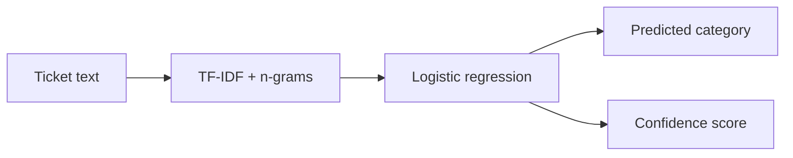

# Nlp Ticket Classifier

[](https://www.python.org/) [](#testing) [](LICENSE)

> Automatically route support tickets with TF-IDF features and logistic-regression classification.

## Why this project exists

Support teams can automatically route incoming tickets to billing, access, bug, or feature queues before human triage.

The implementation is intentionally small and reproducible so the underlying AI reasoning is easy to inspect, benchmark, and discuss.

## AI concepts demonstrated

TF-IDF, n-grams, linear classification, confidence scores, feature engineering, supervised learning

## Architecture



## Results

The demo correctly routes three new example tickets to **access**, **bug**, and **feature** on the included toy dataset.

Because the dataset is intentionally tiny, the results demonstrate the pipeline rather than production-level accuracy.

## Project structure

```text
nlp-ticket-classifier/
├── README.md
├── LICENSE
├── requirements.txt
├── examples/
│   └── demo.py
├── src/
│   └── implementation
└── tests/
    └── test_*.py
```

## Run locally

```bash
python -m venv .venv
# macOS/Linux
source .venv/bin/activate
# Windows PowerShell
# .venv\Scripts\Activate.ps1

pip install -r requirements.txt
PYTHONPATH=. python examples/demo.py
```

## Testing

```bash
PYTHONPATH=. pytest -q
```

## Ideas for extending the project

- Scale the environment or dataset and compare runtime and search behavior.
- Add richer visualizations or an interactive interface.
- Introduce additional baselines and ablation experiments.
- Add configuration files so experiments are reproducible from the command line.

## Portfolio note

This project is independently structured and documented as a portfolio implementation inspired by AI concepts studied in CS221. Do not publish course-provided starter code, solutions, tests, or restricted materials.

## GitHub metadata

**Repository name**

`nlp-ticket-classifier`

**Description**

`Automatically route support tickets with TF-IDF features and logistic-regression classification.`

**Topics**

`natural-language-processing` `text-classification` `tfidf` `machine-learning` `scikit-learn` `python` `classification` `cs221`
